# Ahmed Elmarrouni - Mini Project React

This project is a **React-based e-commerce web application** featuring user authentication, a shopping cart, product management, and a dashboard for administrators. It is built using modern tools like **React**, **Redux**, **Vite**, **Tailwind CSS**, **PrimeReact**, and **Axios** for API interactions.

---

## Table of Contents

1. [Features](#features)
2. [Technologies Used](#technologies-used)
3. [Project Structure](#project-structure)
4. [Setup Instructions](#setup-instructions)
5. [Available Scripts](#available-scripts)
6. [API Integration](#api-integration)
7. [Docker Setup](#docker-setup)
8. [Screenshots](#screenshots)
9. [License](#license)

---

## Features

- **Product Management**: Admins can add, edit, and delete products.
- **Dashboard**: Includes charts, customer data, and orders overview.
- **Authentication**: Users can log in, sign up, and access personalized features.
- **Shopping Cart**: Add products to the cart and proceed to checkout.
- **Order Management**: View orders and purchase history.
- **Dynamic Routing**: Uses React Router for seamless navigation.
- **PrimeReact Components**: Styled UI components for a modern interface.

---

## Technologies Used

- **React**: Frontend framework.
- **Vite**: Modern build tool for fast development.
- **Redux**: State management for cart and application state.
- **PrimeReact**: UI component library.
- **Axios**: For making API requests.
- **JSON Server**: Mock API to simulate a backend.
- **Tailwind CSS**: For styling.

---

## Project Structure

```
src/
├── Components/
│   ├── Admin/          # Admin dashboard and related components
│   ├── Cart/           # Shopping cart pages
│   ├── Checkout/       # Checkout-related pages
│   ├── Home/           # Homepage and product listings
│   ├── Inscription/    # Authentication (Login/Signup)
├── reducers/           # Redux reducers
├── store/              # Redux store
├── App.jsx             # Main app component
├── main.jsx            # App entry point
└── styles/             # Global styles
```

---

## Setup Instructions

### Prerequisites

- **Node.js** (v18 or later)
- **npm** (v8 or later)

### Steps to Run the Application

1. **Install dependencies:**

   ```bash
   npm install
   ```

2. **Run the JSON Server:**

   ```bash
   npm run server
   ```

   This will run a mock API at `http://localhost:3000`.

3. **Run the React development server:**

   ```bash
   npm run dev
   ```

   Access the application at `http://localhost:5173`.

---

## Available Scripts

- **`npm run dev`**: Starts the development server using Vite.
- **`npm run build`**: Builds the application for production.
- **`npm run lint`**: Runs ESLint for linting JavaScript and JSX files.
- **`npm run preview`**: Serves the production build locally.
- **`npm run server`**: Starts the JSON Server with the mock API.

---

## API Integration

### JSON Server

The project uses `db.json` as a mock database, providing the following endpoints:

- **Products**: `http://localhost:3000/products`
- **Users**: `http://localhost:3000/users`
- **Orders**: `http://localhost:3000/orders`
- **Carts**: `http://localhost:3000/carts`

### Axios Configuration

Axios is used to interact with these endpoints for CRUD operations.

---

## Docker Setup

The project includes a `Dockerfile` and `docker-compose.yml` for containerized development.

1. **Build the Docker image:**

   ```bash
   docker build -t mini-store:dev .
   ```

2. **Run the application using Docker Compose:**

   ```bash
   docker-compose up
   ```

   The React app will be available at `http://localhost:5173`.

---

## Screenshots

### Home Page

Where all products are displayed:
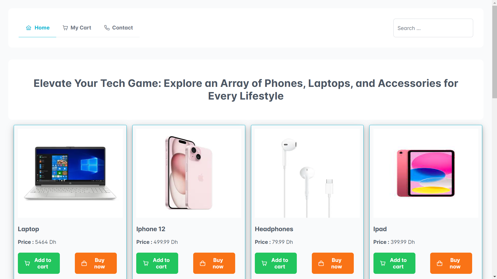

### Footer

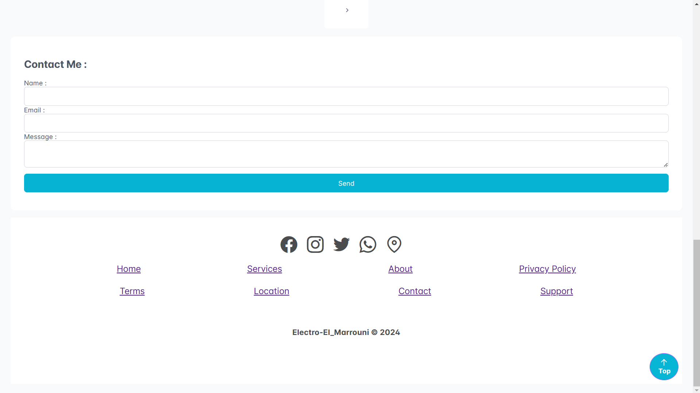

### Product Details

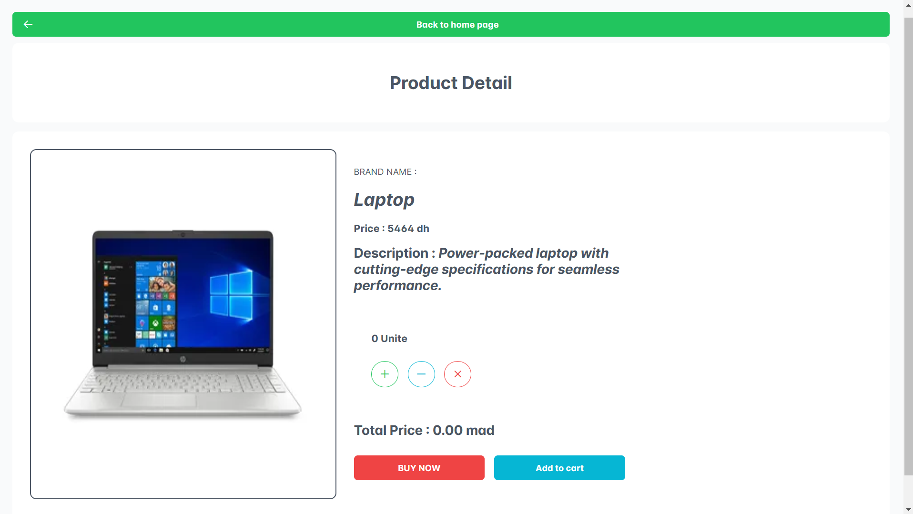

### My Cart

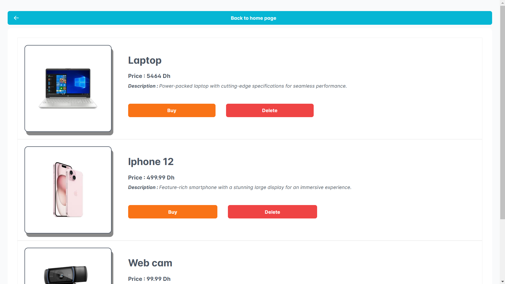

### Login for Sellers

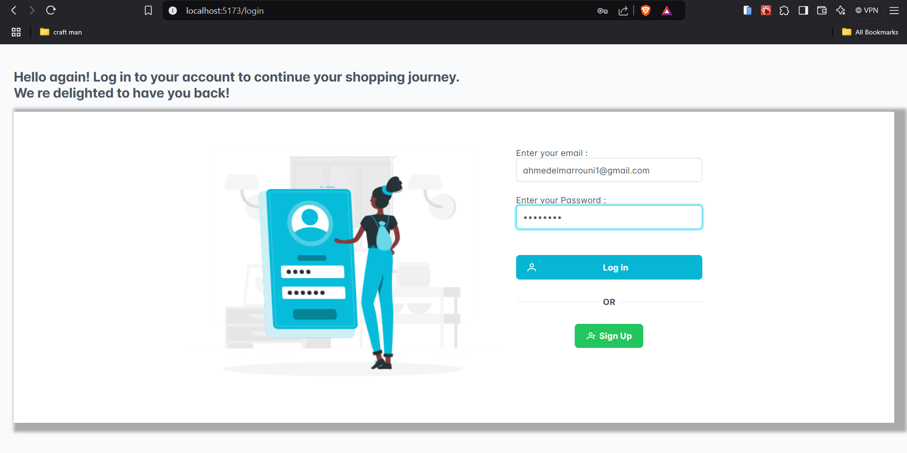

### Sign-Up Page

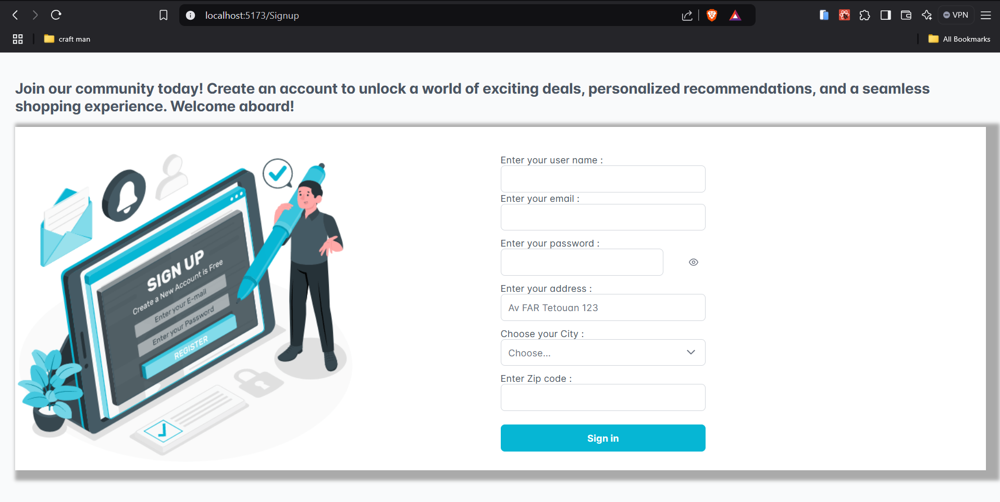

### Seller's Home Page

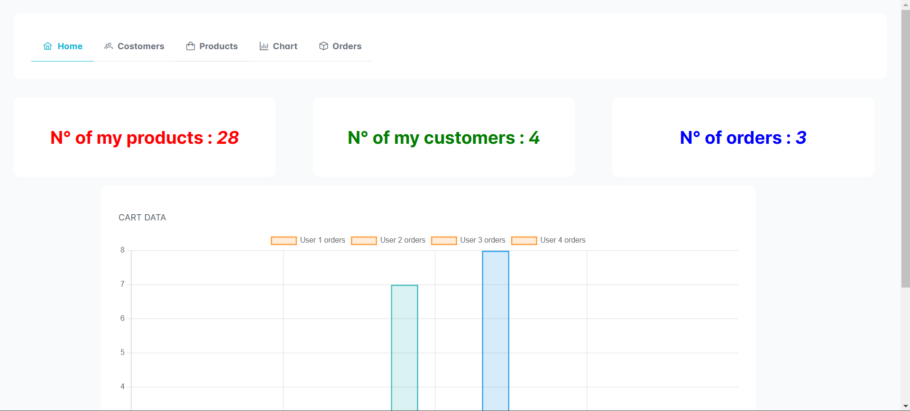

### Product Data Chart

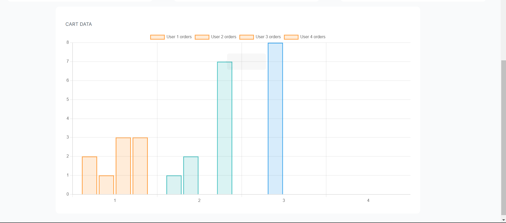

### Manage Products

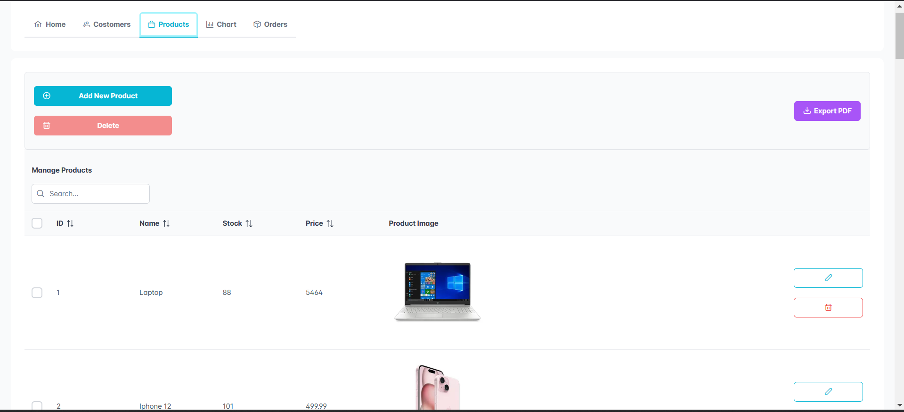

### Charts

- **Products in Stock**:
  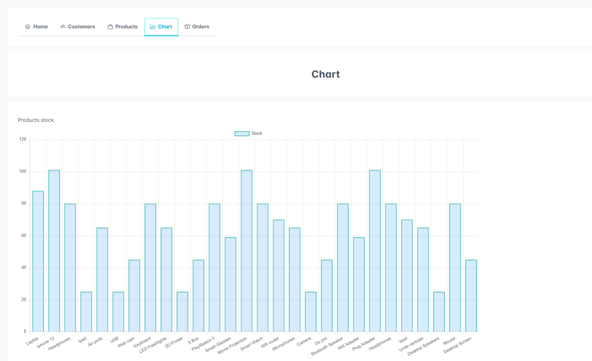
- **Total Orders per User**:
  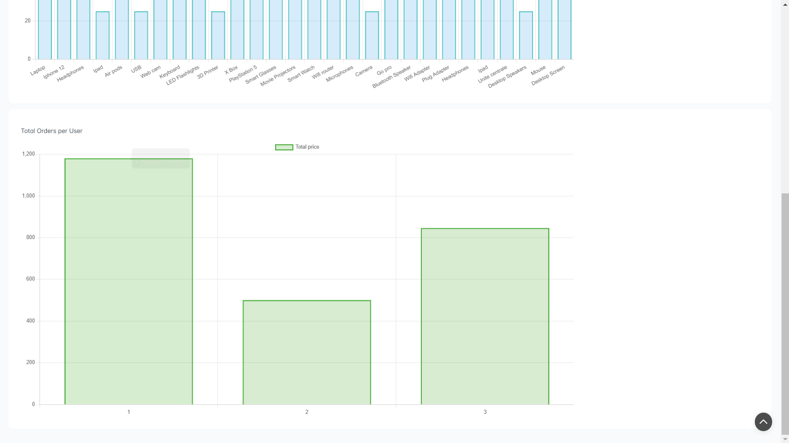

### Admin Dashboard

- **Manage Users**:
  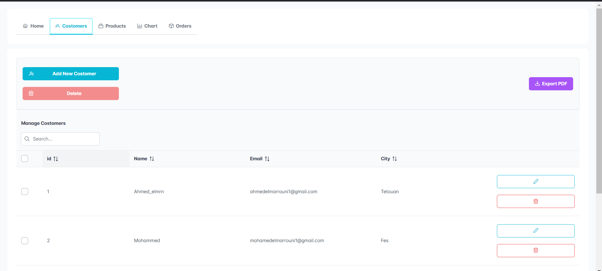

---

## License

This project is licensed under the [MIT License](LICENSE).

---
